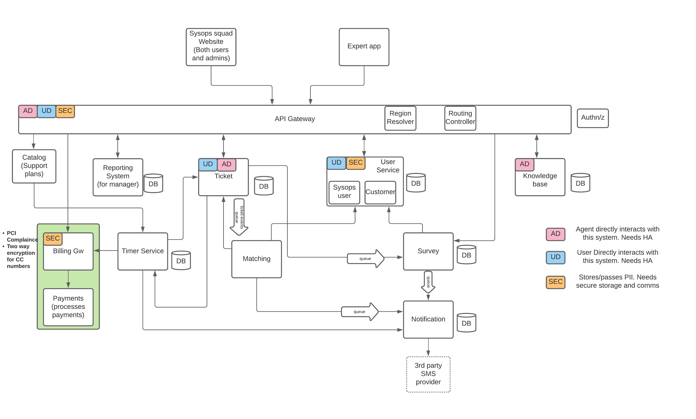

# Proposed Architecture: Penultimate Electronics

# Key Components

### API Gateway

All the incoming requests to the system will enter through the API gateway. It will handle the Authentication and Authorization for each request and will complete the routing of the request.

To support the migration plan, there will be 2 additional sub-components in the API Gateway. As the roll-out is planned to be done at a per region basis, so these components will handle the appropriate routing of the incoming request (monolist or new-system), based on the locality.

1. **Region Resolver** -  This will resolve the locality from the incoming request.
2. **Routing Controller** - Based on the region of the incoming reqest, this component will handle the further routing.

### User Service

The user service will maintain the profile details of every sysops user. The service will have two components to handle the external and internal user information.

1. **Sysops User** -  This will have the profile details of sysops users (Experts, Admins, Managers)
2. **Customers** - This will have the details of the customers of Penultimate Electronics. This component will need a higher level of availability and reliability.

This will be a Tier-1 service with high availability requirements for read traffic. Hence, the storage will have read-replicas to serve the read traffic and to reduce load on the write instances.

### Ticket Service

This service will handle the ticketing workflow. The customer will interact with Ticket service to create support tickets, the tickets will be created and the details will be pushed to a message queue that will be consumed by the Matching service to assign an expert. The experts will also interact with the ticket service if they want to update the ticket or reject it.

The responsibilities of the Ticket service can be described as follows -

- **Ticket Creation and Storage** -  Creation of tickets by customers. Store the ticket information in a highly available storage. Emits a event in the message queue for Matching service to consume.
- **Ticket Updates** - Handle ticket updates by the experts/customers and emit a event in the message queue to notify the consumers about the update.
- **Expert Reject** - If an experts rejects the tickets, an event is emitted for the matching service to reassign an expert.
- **Ticket SLA Tracking** - At each stage of the ticket lifecyle, we set a timer in the timer-service to track if the ticket progress is meeting the desired SLAs. When the timer is triggeres, the ticket status is checked, and appropriate actions are taken.

This will be a Tier-1 service with high availability requirements for write traffic. The storage will have multi-master replication to divide the write load among multiple instances.

### Matching Service

This service will handle expert assignments for tickets. The service consumes the incoming(newly created, expert rejected) tickets information from the message queue published by the Ticket Service.

The matching service will contact the user service to get the expert availability and skill-set details and will assign the tickets to experts based on the implemented matching strategy.

It will also update the ticket state to assigned which will result in an event emitted in message-queue that will be consumed by the notification service to notify the experts.

The matching service can consume the incoming request at its own pace as it uses message queues, so high availability requirements are not very strict here.

### Timer Service

The timer service handles the creation of timers and calling the respective services when the timer triggers with the metadata information. It will have the following responsibilities

- Each ticket state update (creation, assign, etc.) will set a timer in the timer-service. It will be used to track the ticket progress SLAs.
- For each of the customer there will be monthly timers set, to deduct the periodic payments based on their purchased plans.

### Survey Service

This will handle the creation of surveys once a ticket is resolved. When the expert marks a ticket as completed, the ticket service updates the ticket status and sends out an event in the message-queue with ticket details.

The Survey-service consumes this message and creates a survey based on the ticket information. It then sends out the survey details to be sent to the customer in a message-queue. The notification service handles the delivery of this survey.

On receiving the survey, the customers directly interact with the Survey service to submit their response.

The service doesn't affect any critical flow of the system, so we have kept it as a Tier-2 service with low availability and reliability requirements.

### Notification Service

Notification service deals with sending out all the notifications to customers and experts. It handles tthe delivery of SMSm, emails, and push notifications to the expert app.

It consumes data from message-queues and sends out the notifications with the help of some third-party vendors. It also tracks the notification delivery rate which can be checked by the managers to assess the performance of the vendors.

It consumes the incoming requests at its own pace as it uses message queues, so high availability requirements are not very strict here.

### Payment Service

This service will handle the billing information for the sysops customers. This will have integration with a payment gateway to deduct the subscription from the registered credit-cards on a montly basis.

The security requirements are high for this service, as it stores the user credit-card and billing informations.

The service will be made PCI Complaince and will have two-way encryption for credit-card details.

### Knowledge Base

This will contain the internal knowledge base of the sysops-squad experts. Experts will interact with this service to search for information and to add/update some existing informations.

The read is more important in the system compared to writes, so we will can have read replica storage to have a fault tolerance.

### Reporting Service

The Reporting Service will create reports for the Managers. These reports will have information on the ticketing effeciency, expert efficiency, and finance data.

For each ticket update, Ticket Service emits some events in message queues. Those messages are consmed, transformed, and stored in a databse by the reporting service. Based on this data, it generates the reports.

### Product Catalog

It will be a very small component that will have all the available product details and support-plan subscriptions. The admin users can update these details.

The read is requirements are much higher in the system compared to writes, so we need not handle the write failure scenarios.

